# simple-railway-captcha-solver
[Click here or scroll down for english version](#english-version)

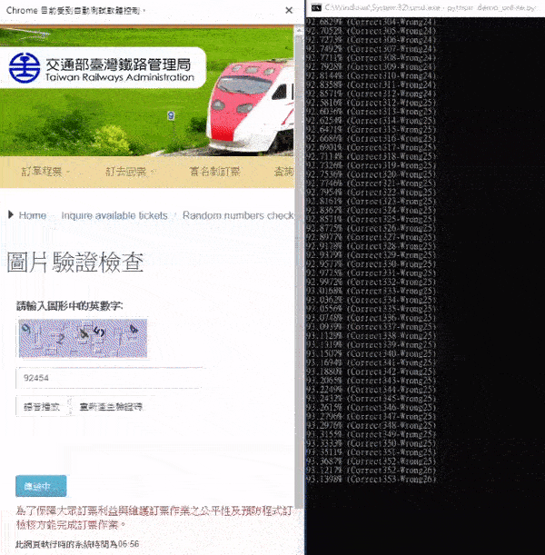

本專案利用簡單的Convolutional Neural Network來實作辨識台鐵訂票網站的驗證碼，訓練集及驗證集的部分以模仿驗證碼樣式的方式來產生、另外測試集的部分則自台鐵訂票網站擷取，再以手動方式標記約3000筆。

目前模型單碼辨識率最高達到```99.39%```，在台鐵網站上以查詢剩餘車票功能來測試驗證碼，整體辨識成功率(全部字元正確)達到```91.57%```。

底下有詳盡的說明。

|Name|Description|
|----|----|
|captcha_gen.py|模仿驗證碼樣式建立訓練集|
|captcha_scrawl.py|從台鐵網站取得真實驗證碼圖|
|train_cnn_imitate_5.py|建立CNN並以模仿驗證碼訓練(5碼辨識)|
|train_cnn_imitate_6.py|建立CNN並以模仿驗證碼訓練(6碼辨識)|
|train_cnn_imitate_56.py|建立CNN並以模仿驗證碼訓練(辨識是5碼or6碼)|
|data_augment.py|用於真實驗證碼的資料增強|
|train_cnn_real_5.py|建立CNN並以真實驗證碼訓練(5碼辨識)|
|train_cnn_real_6.py|建立CNN並以真實驗證碼訓練(6碼辨識)|
|train_cnn_real_56.py|建立CNN並以真實驗證碼訓練(辨識是5碼or6碼)|
|demo_cnn.py|Demo載入模型並以測試集評估辨識率|
|demo_online.py|Demo載入模型並在台鐵網站上評估辨識率|

## 溫馨提醒
鐵路法第65條中提到：```「...以不正方法將虛偽資料或不正指令輸入電腦或其相關設備而購買車票、取得訂票或取票憑證者，處五年以下有期徒刑或科或併科新臺幣三百萬元以下罰金。」```，我想使用程式辨識驗證碼來自動訂票，應該也在其中"不正方法"的範疇中。

此專案僅供學術研究，所以請不要利用建立的模型辨識驗證碼去自動訂票，這是違法的喔。

## 0.-Dependencies
|Name|Version|
|----|----|
|tensorflow|1.4.0|
|tensorflow-gpu|1.4.0|
|tensorflow-tensorboard|0.4.0rc3|
|Keras|2.1.2|
|h5py|2.7.1|
|Pillow|5.1.0|
|numpy|1.13.3|

## 1.-Training set?
要建立一個辨識驗證碼的CNN模型其實並非難事，難的是要如何取得標記好的訓練集呢?

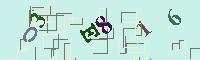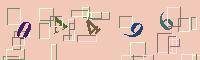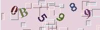

在這邊我們會嘗試兩種方法(2.與3.)：
#### 2.-模仿驗證碼的樣式，自行產生訓練集和驗證集
因為要手動標記上萬張驗證碼是非常費時的，所以我們可以試著模仿產生一些驗證碼看看。

不過當然，我們產生的資料集必須非常接近真實的驗證碼，否則最後訓練完可能用在真實的驗證碼上效果會非常的差。

#### 3.-標記少量的驗證碼，以資料增強的方式擴充資料集
因為不一定每一種驗證碼都可以很容易地找出他的樣式或規律等等，有時候我們還是得用手動方式標記一些驗證碼。

在這種情況下，我們可以透過資料增強的方法來擴充我們的資料集，讓我們的網路有更多資料可以學習。

```(註:在台鐵驗證碼的例子中，自從改版加入英文字後，因為英文字的出現機率遠低於數字(每digit大約只有1~5%)，所以在手動標記的真實資料集中，英文字的比例是極低的，造成數據很不平衡。且在真實驗證碼中，一張驗證碼最多只會出現一個英文字，即使我們用資料增強的方式，也很難去做到平衡數字及英文的資料比例。雖然似乎可以透過設定class weight的方式來改善，但是keras好像不支援以one-hot encoding表示的輸出設定class weight...。這部分暫時想不到方式解決，不過若只是要訓練一個勉強堪用的模型，用這個方式還是可行的，因為實際上台鐵驗證碼英文出現的比例也沒有非常高。)```

--------------------

## 2.1-Generate training and validation set
讓我們來模仿產生一些驗證碼吧！
首先我們要先觀察驗證碼，你可以寫一支爬蟲程式(eg.```captcha_scrawl.py```)去擷取一兩百張驗證碼回來細細比對。我們不難發現台鐵的驗證碼不外乎由兩個主要元素組成：
- ```5 ~ 6碼```的數字及英文(不包含O和I)，大小似乎不一致，而且都有經過旋轉，另外顏色是浮動的。
- 背景是浮動的顏色，另外還有不少干擾的線條，看起來應該是矩形，由黑線和白線組成，且有部分會蓋到數字上面。

進一步研究會發現:
- 數字的旋轉角度約在```-55 ~ 55度```間，大小約```25 ~ 27pt```。
- 字型的部分，仔細觀察會發現同一個字會有兩種不一樣的樣式，推測是有兩種字型隨機更替，其中一個很明顯是```Courier New-Bold```，另一個比對一下也不難發現即是```Times New Roman-Bold```。
- 背景和字型顏色的部分，可以用一些色彩均值化的手法快速的從數百張的驗證碼中得出每一張的背景及數字的顏色，進而我們就能算出顏色的範圍。這部分可以用OpenCV的k-means來實作，這邊就不再贅述。

背景的R/G/B範圍約是在```180 ~ 250```間，文字的部分則是```10 ~ 140```間。
- 干擾的線條是矩形，有左、上是黑線條且右、下是白線條和倒過來，共兩種樣式(也可以當作是旋轉180度)，平均大約會出現```30 ~ 32個```隨機分布在圖中，長寬都大約落在```5 ~ 21px```間。
另外，大約有4成的機會白線會蓋在數字上，黑線蓋在文字上的機率則更低。

有了這些觀察，只差一點點就可以產生訓練集了，我們現在來觀察文字都落在圖片上的甚麼位置上:

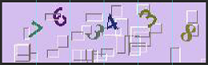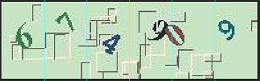

從這幾張圖中不難看出文字並非規則地分布在圖片上，我們可以猜測文字是旋轉後被隨機左移或右移了，甚至還會有重疊的情況，所以沒辦法用切割的方式一次處理一個文字。

以上就是我們簡單觀察到的驗證碼規則，訓練集產生的部分實作在```captcha_gen.py```中，雖然寫得有點雜亂，不過沒甚麼特別的地方，就是照著上面的規則產生，可以試著以自己的方式實作看看。

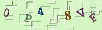

```python
if __name__ == "__main__":
    generate(50000, "./data/56_imitate_train_set/",  ENGP=100, FIVEP=50, ENGNOLIMIT=True, filename="train")
    generate(10240, "./data/56_imitate_vali_set/",  ENGP=100, FIVEP=50, ENGNOLIMIT=True, filename="vali")
    generate(50000, "./data/5_imitate_train_set/",  ENGP=100, FIVEP=100, ENGNOLIMIT=True, filename="train")
    generate(10240, "./data/5_imitate_vali_set/",  ENGP=100, FIVEP=100, ENGNOLIMIT=True, filename="vali")
    generate(50000, "./data/6_imitate_train_set/",  ENGP=100, FIVEP=0, ENGNOLIMIT=True, filename="train")
    generate(10240, "./data/6_imitate_vali_set/",  ENGP=100, FIVEP=0, ENGNOLIMIT=True, filename="vali")
```

最後會為我們預計建立的三個CNN(2.2.1會提到)各分別產生50000筆Training data和10240筆Validate data，答案則標記在csv檔中。

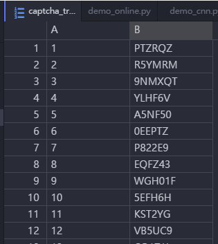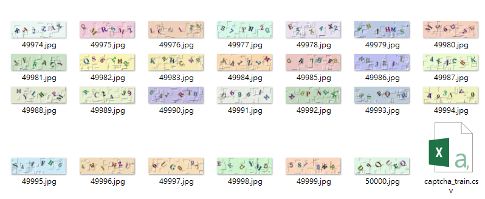


## 2.2.1-Building Convolution Neural Network
有了資料集，我們就可以來建立CNN了！

在這邊我們會建立三個CNN，分別是```1.辨識5碼驗證碼圖片的CNN```、```2.辨識6碼驗證碼圖片的CNN``` 以及 ```3.辨識圖片是5碼or6碼驗證碼的CNN```。

首先我們先來實作前兩個辨識驗證碼的CNN:輸入是```60*200```的圖片，共有3個channel(R/G/B)，所以是shape會是```(60, 200, 3)```。

中間透過數層由ReLU函數激發的Convolution Layer擷取特徵，並以2x2的Max pooling layer採樣減少計算量、BatchNormalization layer做標準化 及 Dropout Layer隨機捨棄一些神經元(避免overfitting)，最後用Flatten Layer來把資料降到1維，輸出到全連接層：5/6個34神經元的Softmax regression分類器。

(註:34個代表數字0~9以及英文字母去除O及I的數量，另外5碼和6碼只差在最後有幾個Softmax regression分類器。)

以六碼為例(train_cnn_imitate_6.py):
```python
in = Input((60, 200, 3))
out = in
out = Conv2D(filters=32, kernel_size=(3, 3), padding='same', activation='relu')(out)
out = Conv2D(filters=32, kernel_size=(3, 3), activation='relu')(out)
out = BatchNormalization()(out)
out = MaxPooling2D(pool_size=(2, 2))(out)
out = Dropout(0.3)(out)
out = Conv2D(filters=64, kernel_size=(3, 3), padding='same', activation='relu')(out)
out = Conv2D(filters=64, kernel_size=(3, 3), activation='relu')(out)
out = BatchNormalization()(out)
out = MaxPooling2D(pool_size=(2, 2))(out)
out = Dropout(0.3)(out)
out = Conv2D(filters=128, kernel_size=(3, 3), padding='same', activation='relu')(out)
out = Conv2D(filters=128, kernel_size=(3, 3), activation='relu')(out)
out = BatchNormalization()(out)
out = MaxPooling2D(pool_size=(2, 2))(out)
out = Dropout(0.3)(out)
out = Conv2D(filters=256, kernel_size=(3, 3), activation='relu')(out)
out = BatchNormalization()(out)
out = MaxPooling2D(pool_size=(2, 2))(out)
out = Flatten()(out)
out = Dropout(0.3)(out)
out = [Dense(34, name='digit1', activation='softmax')(out),\
    Dense(34, name='digit2', activation='softmax')(out),\
    Dense(34, name='digit3', activation='softmax')(out),\
    Dense(34, name='digit4', activation='softmax')(out),\
    Dense(34, name='digit5', activation='softmax')(out),\
    Dense(34, name='digit6', activation='softmax')(out)]
model = Model(inputs=in, outputs=out)
```

完成後要來compile模型，這邊loss使用```categorical_crossentropy```、optimizer*使用```Adam```，而metrics理所當然是```accuracy```了。
```python
model.compile(loss='categorical_crossentropy', optimizer='Adamax', metrics=['accuracy'])
```

*關於optimizer的選擇，可以參考這兩篇，寫得不錯：
1. An overview of gradient descent optimization algorithms -  http://ruder.io/optimizing-gradient-descent/index.html
2. SGD，Adagrad，Adadelta，Adam等优化方法总结和比较 - http://ycszen.github.io/2016/08/24/SGD%EF%BC%8CAdagrad%EF%BC%8CAdadelta%EF%BC%8CAdam%E7%AD%89%E4%BC%98%E5%8C%96%E6%96%B9%E6%B3%95%E6%80%BB%E7%BB%93%E5%92%8C%E6%AF%94%E8%BE%83/
**

--

最後來看看model的summary輸出長甚麼樣子：
```python
model.summary()

__________________________________________________________________________________________________
Layer (type)                    Output Shape         Param #     Connected to
==================================================================================================
input_1 (InputLayer)            (None, 60, 200, 3)   0
__________________________________________________________________________________________________
conv2d_1 (Conv2D)               (None, 60, 200, 32)  896         input_1[0][0]
__________________________________________________________________________________________________
conv2d_2 (Conv2D)               (None, 58, 198, 32)  9248        conv2d_1[0][0]
__________________________________________________________________________________________________
batch_normalization_1 (BatchNor (None, 58, 198, 32)  128         conv2d_2[0][0]
__________________________________________________________________________________________________
max_pooling2d_1 (MaxPooling2D)  (None, 29, 99, 32)   0           batch_normalization_1[0][0]
__________________________________________________________________________________________________
dropout_1 (Dropout)             (None, 29, 99, 32)   0           max_pooling2d_1[0][0]
__________________________________________________________________________________________________
conv2d_3 (Conv2D)               (None, 29, 99, 64)   18496       dropout_1[0][0]
__________________________________________________________________________________________________
conv2d_4 (Conv2D)               (None, 27, 97, 64)   36928       conv2d_3[0][0]
__________________________________________________________________________________________________
batch_normalization_2 (BatchNor (None, 27, 97, 64)   256         conv2d_4[0][0]
__________________________________________________________________________________________________
max_pooling2d_2 (MaxPooling2D)  (None, 13, 48, 64)   0           batch_normalization_2[0][0]
__________________________________________________________________________________________________
dropout_2 (Dropout)             (None, 13, 48, 64)   0           max_pooling2d_2[0][0]
__________________________________________________________________________________________________
conv2d_5 (Conv2D)               (None, 13, 48, 128)  73856       dropout_2[0][0]
__________________________________________________________________________________________________
conv2d_6 (Conv2D)               (None, 11, 46, 128)  147584      conv2d_5[0][0]
__________________________________________________________________________________________________
batch_normalization_3 (BatchNor (None, 11, 46, 128)  512         conv2d_6[0][0]
__________________________________________________________________________________________________
max_pooling2d_3 (MaxPooling2D)  (None, 5, 23, 128)   0           batch_normalization_3[0][0]
__________________________________________________________________________________________________
dropout_3 (Dropout)             (None, 5, 23, 128)   0           max_pooling2d_3[0][0]
__________________________________________________________________________________________________
conv2d_7 (Conv2D)               (None, 3, 21, 256)   295168      dropout_3[0][0]
__________________________________________________________________________________________________
batch_normalization_4 (BatchNor (None, 3, 21, 256)   1024        conv2d_7[0][0]
__________________________________________________________________________________________________
max_pooling2d_4 (MaxPooling2D)  (None, 1, 10, 256)   0           batch_normalization_4[0][0]
__________________________________________________________________________________________________
flatten_1 (Flatten)             (None, 2560)         0           max_pooling2d_4[0][0]
__________________________________________________________________________________________________
dropout_4 (Dropout)             (None, 2560)         0           flatten_1[0][0]
__________________________________________________________________________________________________
digit1 (Dense)                  (None, 34)           87074       dropout_4[0][0]
__________________________________________________________________________________________________
digit2 (Dense)                  (None, 34)           87074       dropout_4[0][0]
__________________________________________________________________________________________________
digit3 (Dense)                  (None, 34)           87074       dropout_4[0][0]
__________________________________________________________________________________________________
digit4 (Dense)                  (None, 34)           87074       dropout_4[0][0]
__________________________________________________________________________________________________
digit5 (Dense)                  (None, 34)           87074       dropout_4[0][0]
__________________________________________________________________________________________________
digit6 (Dense)                  (None, 34)           87074       dropout_4[0][0]
==================================================================================================
Total params: 1,106,540
Trainable params: 1,105,580
Non-trainable params: 960
```

架構以圖片呈現的話:

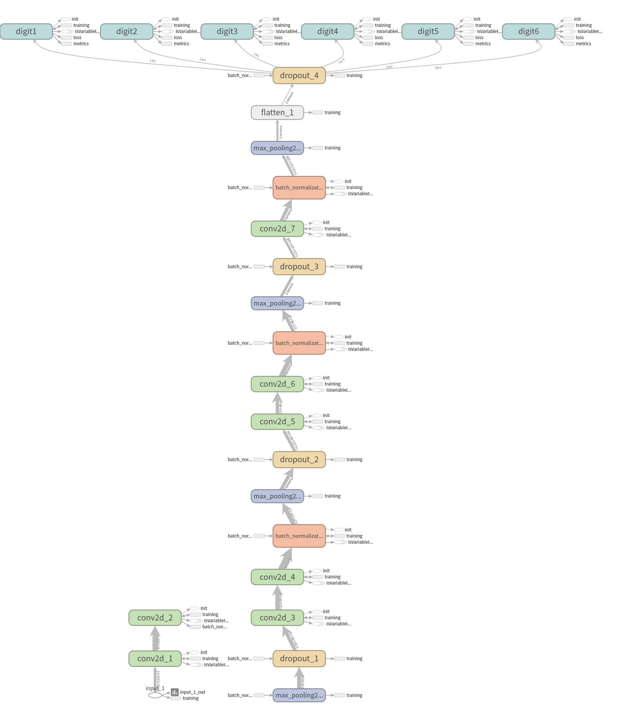

## 2.2.2-Building Another Convolution Neural Network
前面提到，我們還要建立一個用來識別驗證碼是5碼還是6碼的模型，我們最後會讓資料先經過這個模型看看輸入的驗證碼是5碼還是6碼，再送入對應的模型去辨識出上面的文字。

這個模型的架構基本上跟前面兩個是一樣的，只是Dropout Rate以及輸出不同。輸出的部份我們從數個softmax分類器改為一個sigmoid分類器，並將loss改為```binary_crossentropy```來compile模型。

這部分實作於```train_cnn_imitate_56.py```，下面只大略列出不同處:

```python
out = Dense(1, name='6digit', activation='sigmoid')(tensor_out)
model = Model(inputs=in, outputs=out)
model.compile(loss='binary_crossentropy', optimizer='adam', metrics=['accuracy'])
```

最後當這個sigmoid分類器輸出>0.5時，我們視為辨識出6碼的驗證碼，反之則為5碼。

## 2.3-Load the training set
在訓練之前我們要先將資料載入到記憶體中，前面產生訓練集和驗證集的時候，我們是將驗證碼存成一張張編號好的圖片，並用csv檔記錄下了答案。

這邊一樣以6碼的為例，首先我們先處理X的部分，也就是特徵值，這邊就是指我們的圖片。
而要輸入進CNN的資料必須是numpy array的形式，所以我們用Pillow來讀取圖片並轉為numpy格式：

```python
traincsv = open('./data/6_imitate_train_set/captcha_train.csv', 'r', encoding = 'utf8')
for row in csv.reader(traincsv):
    image = Image.open("./data/6_imitate_train_set/" + row[0] + ".jpg") # 讀取圖片
    nparr = np.array(image) # 轉成np array
    nparr = nparr / 255.0
```

這時我們下```nparr.shape```，可以看到矩陣的大小是```(60, 200, 3)```，跟前面模型設計的Input是相同的。

而我們計劃使用50000張圖片來訓練，所以最後輸入給CNN的矩陣大小會是```(50000, 60, 200, 3)```，這部分只要利用stack就可以把它們合併，整理成下面:

```python
train_data = np.stack([np.array(Image.open("./data/6_imitate_train_set/" + row[0] + ".jpg"))/255.0 for row in csv.reader(traincsv)])
```

最後train_data的shape就會是```(50000, 60, 200, 3)```。

接下來Y則是訓練集的標記，也就是我們訓練集的答案。

因為我們的模型是多輸出的結構(6組softmax函數分類器)，所以Y要是一個含有6個numpy array的list，大概像是這樣：
```
[[第一張第1個數字,...,最後一張第1個數字], [第一張第2個數字,...,最後一張第2個數字], [...], [...], [...], [...]]
```
而其中每個數字都是以one-hot encoding表示，例如0就是```[1, 0, 0, 0, ....,0]```，2就是```[0, 0, 1, 0, ....,0]```

```python
traincsv = open('./data/6_imitate_train_set/captcha_train.csv', 'r', encoding = 'utf8') # 讀取訓練集的標記
read_label = [toonehot(row[1]) for row in csv.reader(traincsv)] # 將每一行的文字轉成one-hot encoding
train_label = [[] for _ in range(6)] # 各組輸出的答案要放到train_label

for arr in read_label:
    for index in range(6):
        train_label[index].append(arr[index]) # 原本是[[第1字答案, ..., 第6字答案],......, [第1字答案, ..., 第6字答案]]
                                              # 要轉成[[第1字答案,..., 第1字答案],..., [第6字答案,..., 第6字答案]]才符合Y的輸入
train_label = [arr for arr in np.asarray(train_label)] # 最後要把6個numpy array 放在一個list
```

## 2.4-Validation set
驗證集的載入方式跟訓練集相同，這邊略過。

## 2.5-Callback
在這邊要用到三個callback:

### 1.ModelCheckPoint

```python
checkpoint = ModelCheckpoint(filepath, monitor='val_digit6_acc', verbose=1, save_best_only=True, mode='max')
```

用於儲存最佳辨識率的模型，每次epoch完會檢查一次，如果比先前最佳的acc高，就會儲存model到filepath。

因為在多輸出模型中沒有像是各輸出平均的acc這種東西，觀察前幾epoch後發現```val_digit6_acc```上升最慢，因此用它當作checkpoint的monitor。
(如果要自定義monitor可以自己寫callback，這部分留到未來有空再來實作。)

### 2.Earlystopping

```python
earlystop = EarlyStopping(monitor='val_digit6_acc', patience=5, verbose=1, mode='auto')
```

這邊的monitor設為val_digit6_acc，patience設為5，也就是在驗證集的val_digit6_acc連續5次不再下降時，就會提早結束訓練。(train_cnn_imitate_56是10)

### 3.TensorBoard

```python
tensorBoard = TensorBoard(log_dir = "./logs", histogram_freq = 1)
```

TensorBoard可以讓我們更方便的以圖形化界面檢視訓練結果，要檢視時可以輸入```tensorboard --logdir=logs```來啟動。

最後把他們三個放到list中即可。
```python
callbacks_list = [tensorBoard, earlystop, checkpoint]
```

## 2.6-Training the model
至此為止我們已經把所有需要的資料都準備好了，現在只需要一台好電腦就可以開始訓練了，建議使用GPU來訓練，不然要很久，真的很久....。

若在訓練時出現Resource exhausted的錯誤，可以考慮調低一些參數(如batch_size)。

```python
model.fit(train_data, train_label, batch_size=400, epochs=50, verbose=2, validation_data=(vali_data, vali_label), callbacks=callbacks_list)
```

## 2.7-Result
三個模型都在訓練約25~30epochs後達到EarlyStopping的條件停止，val_acc皆達到```0.99```以上(下圖為imitate_6的訓練結果)：

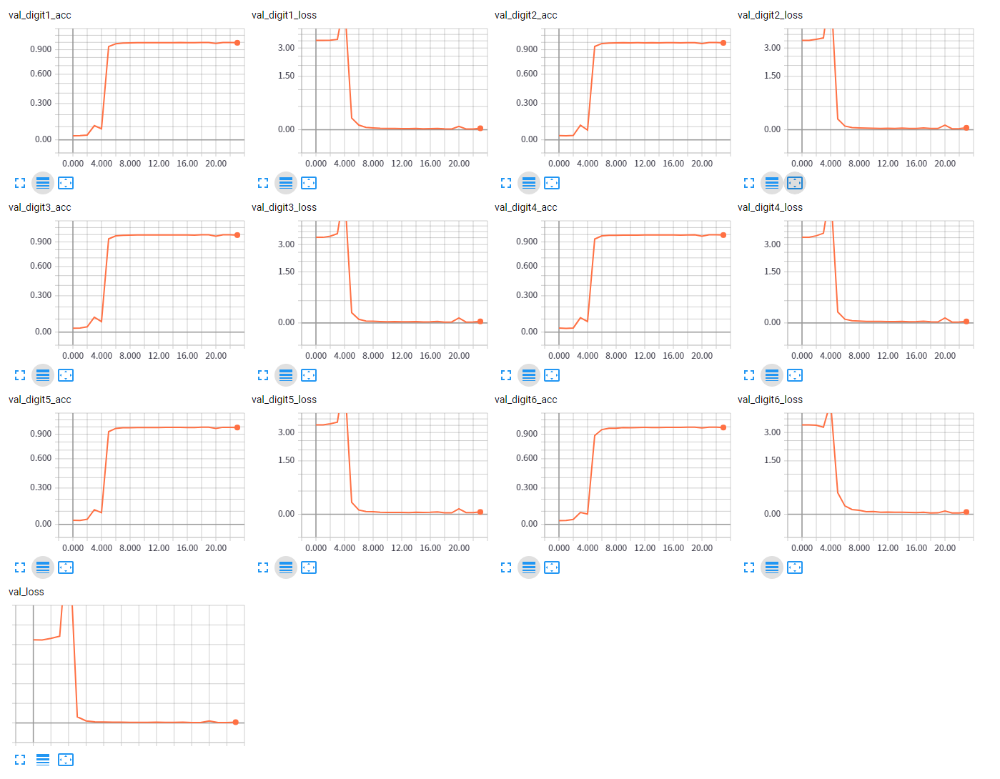

接著利用手動標記的3000張真實驗證碼當測試集來評估模型的辨識率(demo_cnn.py)：

辨識```5碼```驗證碼的模型(train_cnn_imitate_5)對真實驗證碼測試集的單碼辨識率達到平均約```98.87%```，一次辨識成功率(即一次5或6碼都辨識正確)達到約```94.55%```。

辨識```6碼```驗證碼的模型(train_cnn_imitate_6)對真實驗證碼測試集的單碼辨識率達到平均約```98.44%```，一次辨識成功率(即一次5或6碼都辨識正確)達到約```90.45%```。

分類驗證碼是5碼 or 6碼的模型(train_cnn_imitate_56)則達到約```98.13%```。

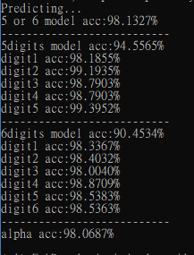

## 2.8-Online Test
模型都完成後，是時候到台鐵的網站上試試身手了！

不過開頭有提到以不正方式訂票是違法的，所以我們這邊僅在查詢剩餘車票的頁面下做測試，並設定適當的延遲，避免對網站伺服器造成負擔。(實作於```demo_online.py```)

這邊是以selenium控制chrome瀏覽器操作，這樣比較簡單，而且看的到畫面比較有感覺。

另外因為台鐵的驗證碼是浮動的，所以驗證碼圖片是以先screenshot，再將驗證碼位置圖片crop下來方式來取得的：

```python
driver.save_screenshot('tmp.png')
location = driver.find_element_by_id('idRandomPic').location
x, y = location['x'] + 5, location['y'] + 5
img = Image.open('tmp.png')
captcha = img.crop((x, y, x+200, y+60))
captcha.convert("RGB").save('captcha.jpg', 'JPEG')
```

其中```location['x'] + 5, location['y'] + 5```是因為畫面上的驗證碼有用css加了一個寬度5的外框上去。

最後執行了1000筆後，我們得到```91.57%```的成功率，大功告成！

--------------------

## 3.1-Label training and dataset
在第三部份我們會用少量手動標記的驗證碼，透過資料增強(Data Augmentation)產生大量資料來訓練模型。

首先我們需要取得一些真實的驗證碼，我們可以寫一支程式簡單地從台鐵網站上下載驗證碼圖片回來(實作於```captcha_scrawl.py```)：

```python
SAVEPATH = "./data/manual_label/"
url = 'http://railway1.hinet.net/ImageOut.jsp'
for i in range(1, 3000):
    response = requests.get(url, stream=True)
    with open(SAVEPATH + str(i) + '.jpg', 'wb') as out_file:
        shutil.copyfileobj(response.raw, out_file)
    del response
    time.sleep(0.5)
```

如此我們就得到了3000張驗證碼，其中大約有1500張是6碼，剩下的則是5碼。(在我寫Readme之前，5碼和6碼的比例大約是1:3，但現在測試卻是1:1，可能網站有更新過吧)

之後我們可以仿照 2.1 的格式去標記驗證碼答案於csv中，也可以做個小工具來輔助標記(https://github.com/JasonLiTW/captcha-label-tool)。

## 3.2-Data Augmentation
因為我們標記的驗證碼有點太少了，所以我們要透過Data Augmentation的方式來產生更多的訓練資料來用！

我們使用Keras內建的ImageDataGenerator，他提供了非常多的功能，詳細可以看這裡:https://keras.io/preprocessing/image/

我們這邊會用到的功能有：```rotation_range=5```(旋轉0~5度), ```shear_range=0.2```(斜變0~0.2度), ```zoom_range=0.05```(放大0~0.05倍)

```python
datagen = ImageDataGenerator(rotation_range=5,shear_range=0.2,zoom_range=0.05,fill_mode='nearest')
```

這邊的datagen是一個generator，它會隨機對圖片做旋轉、斜變和放大。我們預計要讓每張圖片產生50張增強的圖片。詳細的部分實作於```data_augment.py```，依序修改參數對5碼及6碼的驗證碼執行，即可由原本3000張產生到變成150000張驗證碼圖片。

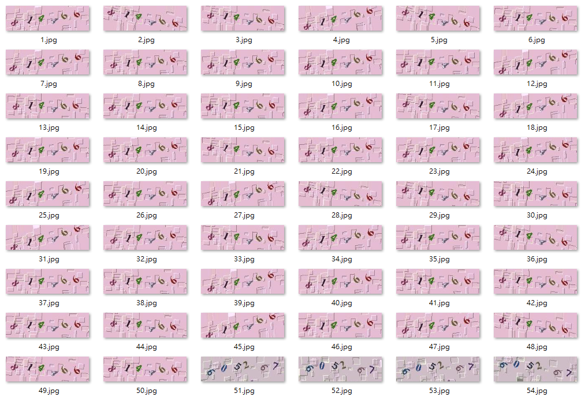


## 3.3-Building Convolution Neural Network
這部分跟2.2的模型是完全相同的，這邊不再贅述。

## 3.4-Load the training and validation set
以6碼的為例，我們現在有75000張驗證碼圖片，我們取其中前60000張為訓練集，後15000張為驗證集來訓練。(驗證集也是一樣，只是改成取後15000張。)

```python
traincsv = open('./data/6_real_train_set/captcha_train.csv', 'r', encoding = 'utf8')
train_data = np.stack([np.array(Image.open("./data/6_real_train_set/" + row[0] + ".jpg"))/255.0 for row in csv.reader(traincsv)][:60000])
traincsv = open('./data/6_real_train_set/captcha_train.csv', 'r', encoding = 'utf8')
read_label = [toonehot(row[1]) for row in csv.reader(traincsv)][:60000]
train_label = [[] for _ in range(6)]
for arr in read_label:
    for index in range(6):
        train_label[index].append(arr[index])
train_label = [arr for arr in np.asarray(train_label)]
```

另外判斷是5碼or6碼的模型，則是各以5/6碼的前60000張各隨機挑選20000張=40000張當訓練集，剩下15000張各隨機挑選5000張=10000張當驗證集。

## 3.5-Callback
跟2.5相同，略過。

## 3.6-Training the model
跟2.6相同，略過。

## 3.7-Result
三個模型都在訓練約20 epochs後達到EarlyStopping的條件停止，val_acc皆達到```0.99```以上。

但由於在```demo_cnn.py```中使用的3000張手動標記驗證碼即為真實驗證碼模型的訓練集，所以沒辦法用來評估其辨識率，所以這邊我們會留到下一部分(3.8)到台鐵網站來評估。

## 3.8-Online Test
最後我們一樣來到台鐵網站做測試，程式的部分同2.8，只要修改model路徑即可。

執行了1000筆後，我們得到```51.63%```的整體成功率，雖然沒有上一部分的結果那麼好，但仍堪用了。

```(註:在台鐵驗證碼的例子中，自從改版加入英文字後，因為英文字的出現機率遠低於數字(每digit大約只有1~5%)，所以在手動標記的真實資料集中，英文字的比例是極低的，造成數據很不平衡。且在真實驗證碼中，一張驗證碼最多只會出現一個英文字，即使我們用資料增強的方式，也很難去做到平衡數字及英文的資料比例。雖然似乎可以透過設定class weight的方式來改善，但是keras好像不支援以one-hot encoding表示的輸出設定class weight...。這部分暫時想不到方式解決，不過若只是要訓練一個勉強堪用的模型，用這個方式還是可行的，因為實際上台鐵驗證碼英文出現的比例也沒有非常高。)```

有趣的是，在交叉測試後我們發現，在辨識是5碼or6碼的模型中，使用真實驗證碼(```train_cnn_real_56.py```)訓練出來的模型的準確率是比使用模仿的(```train_cnn_imitate_56.py```)還要稍微高一些些的。

而另外兩個真實驗證碼訓練出來的模型(```train_cnn_real_5.py```及```train_cnn_real_6.py```)，在英文字母的辨識上辨識率可以說是接近0%，但其實每個digit的辨識率應該都還有90%左右，不過因為乘上同時5/6碼，整體的辨識率就很低了。


## 4.-Issue & Todo
1. 更新英文readme。
2. 重寫captcha_gen.py，有點亂。
3. 嘗試了使用Conditional-DCGAN產生驗證碼，但一直發生mode collapse，之後有空再弄看看了。
4. 嘗試了使用Capsule Network但效果不太好...等有空的時候再整理放上來。


## 5.-Reference
1. An overview of gradient descent optimization algorithms -  http://ruder.io/optimizing-gradient-descent/index.html
2. SGD，Adagrad，Adadelta，Adam等优化方法总结和比较 - http://ycszen.github.io/2016/08/24/SGD%EF%BC%8CAdagrad%EF%BC%8CAdadelta%EF%BC%8CAdam%E7%AD%89%E4%BC%98%E5%8C%96%E6%96%B9%E6%B3%95%E6%80%BB%E7%BB%93%E5%92%8C%E6%AF%94%E8%BE%83/
3. Going Deeper with Convolutions - http://arxiv.org/abs/1409.4842

## 6.-Contact
如果有任何建議或問題，請不吝發Issue或mail(jason860421<at>gmail.com)給我。


--------------------
#### english version
## Note: English version currently is old version!
# simple-railway-captcha-solver
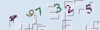
This project uses simple convolution neural network to implement solving the captcha(as above, in Taiwan railway booking website).The training set is generated by imitating the style of captcha, and the validation set is crawling from the booking site and labeled manually for about 1000 records.

Currently, the accuracy of a single digit on the validation set is about ```98.84%```, and overall accuracy is ```91.13%``` (Successfully recognize 6-digits at once).

|Name|Description|
|----|----|
|captcha_gen.py|Generating training set by imitating the style of captcha.|
|train_cnn.py  |Building the model and train it.|
|demo_solver.py|Demo:Load the model and solve the captcha.|

## Dependecies
|Name|Version|
|----|----|
|tensorflow|1.4.0|
|tensorflow-gpu|1.4.0|
|tensorflow-tensorboard|0.4.0rc3|
|Keras|2.1.2|
|h5py|2.7.1|
|Pillow|4.3.0|
|numpy|1.13.3|

## Training set?
It is not difficult for building a CNN model to solve a captcha, but where and how do we get a labeled training set?

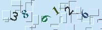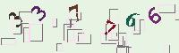

We can write a program to crawl thousands of captcha image, and labeled it manually, but it's a time-consuming job! Maybe we can try to generate some captcha image by imitating it.
But of course, the image we generate should be really close to the real, otherwise, the accuracy on validation set will really bad.

## Generate training set

Firstly we have to observe the captcha, it's easy to find that the captcha is made up of two primary elements:
- ```5 ~ 6 digits``` number and the text size is not same. Furthermore, they are being rotated, and the color is floating.
- The color of background is floating, and there have some white and black interference lines, and some of them will overlay on the number.

And more...:
- The angle of rotation is between about ```-55 ~ 55 degrees```, and the size is about ```25 ~ 27pt```.
- We can found that one number has not only one style, so we guess that there have two fonts randomly in change. The first one obviously is ```Courier New-Bold```, and the second one is ```Times New Roman-Bold```.(You can use software such as Photoshop to cross-comparison.)
- About the range of background and text color, we can through the color quantization such as k-means to get color of every background and text, and so we can calculate the color range.(I used k-means in opencv to implement.)
- The color range(R/G/B) of the background is between about ```180 ~ 250```, and text is between ```10 ~ 140```.
- Those interference lines form a rectangle, they have two styles: left and up sides are black, right and down sides are white, and vice versa.(you can also treat them as be rotated 180 degrees).
- The number of the rectangle is between about ```30 ~ 32```, randomly distribute on captcha image, and the width and height is between about ```5 ~ 21px```. Besides, there has 40% white line will overlay on the number, and about 20% by the black line.

With these observation, we are about to generate training set! Now, let's observe where the number place on the image:


From these images we can find that the text(number) are not regularly distributed on the image, we can guess that the text is randomly moved left or right after a rotation. There has even some text overlap together, so we can't crop the image and process only one number at a time.

Above is the captcha rule we simply observed. The implement of training set generate is in ```captcha_gen.py```, you can try to implement it in your own way.

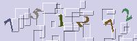

The generator finally will output 50,000 captcha image and a csv labeled answer.

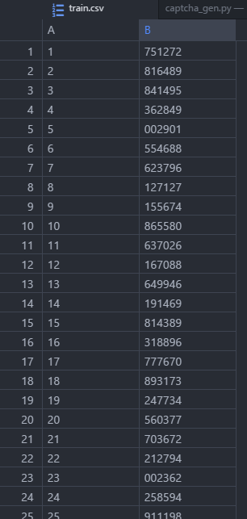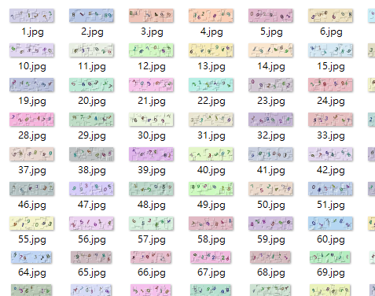


## Building Convolution Neural Network

Let's build a simple CNN model!

The input is ```60*200``` image, it has 3 channel(R/G/B), so the shape is ```(60, 200, 3)```.

Firstly, the input through many convolution layers activated by ReLU function to capture feature, and perform downsampling by Max pooling layer, and then get into Dropout layer(randomly drop out some unit to avoid overfitting) and Flatten layer. Finally, they output to the full connect layer: 6 Softmax regression classifiers, each with 10 neurons.

```python
tensor_in = Input((60, 200, 3))
out = tensor_in
out = Conv2D(filters=32, kernel_size=(3, 3), padding='same', activation='relu')(out)
out = Conv2D(filters=32, kernel_size=(3, 3), activation='relu')(out)
out = MaxPooling2D(pool_size=(2, 2))(out)
out = Conv2D(filters=64, kernel_size=(3, 3), padding='same', activation='relu')(out)
out = Conv2D(filters=64, kernel_size=(3, 3), activation='relu')(out)
out = MaxPooling2D(pool_size=(2, 2))(out)
out = Conv2D(filters=128, kernel_size=(3, 3), padding='same', activation='relu')(out)
out = Conv2D(filters=128, kernel_size=(3, 3), activation='relu')(out)
out = MaxPooling2D(pool_size=(2, 2))(out)
out = Conv2D(filters=256, kernel_size=(3, 3), activation='relu')(out)
out = MaxPooling2D(pool_size=(2, 2))(out)
out = Flatten()(out)
out = Dropout(0.5)(out)
out = [Dense(10, name='digit1', activation='softmax')(out),\
    Dense(10, name='digit2', activation='softmax')(out),\
    Dense(10, name='digit3', activation='softmax')(out),\
    Dense(10, name='digit4', activation='softmax')(out),\
    Dense(10, name='digit5', activation='softmax')(out),\
    Dense(10, name='digit6', activation='softmax')(out)]
model = Model(inputs=tensor_in, outputs=out)
```

Now we can do the next step: compile the model: loss use ```categorical_crossentropy```, optimizer* use ```Adamax```, and metrics is ```accuracy```.
```python
model.compile(loss='categorical_crossentropy', optimizer='Adamax', metrics=['accuracy'])
```

*About the choice of an optimizer, you can refer below:
1. An overview of gradient descent optimization algorithms -  http://ruder.io/optimizing-gradient-descent/index.html
2. SGD，Adagrad，Adadelta，Adam等优化方法总结和比较 - http://ycszen.github.io/2016/08/24/SGD%EF%BC%8CAdagrad%EF%BC%8CAdadelta%EF%BC%8CAdam%E7%AD%89%E4%BC%98%E5%8C%96%E6%96%B9%E6%B3%95%E6%80%BB%E7%BB%93%E5%92%8C%E6%AF%94%E8%BE%83/
**

--

Okay! Now we have finished the design of the model, let's see the summary of model:

```python
model.summary()

__________________________________________________________________________________________________
Layer (type)                    Output Shape         Param #     Connected to
======================================================
input_1 (InputLayer)            (None, 60, 200, 3)   0
__________________________________________________________________________________________________
conv2d_1 (Conv2D)               (None, 60, 200, 32)  896         input_1[0][0]
__________________________________________________________________________________________________
conv2d_2 (Conv2D)               (None, 58, 198, 32)  9248        conv2d_1[0][0]
__________________________________________________________________________________________________
max_pooling2d_1 (MaxPooling2D)  (None, 29, 99, 32)   0           conv2d_2[0][0]
__________________________________________________________________________________________________
conv2d_3 (Conv2D)               (None, 29, 99, 64)   18496       max_pooling2d_1[0][0]
__________________________________________________________________________________________________
conv2d_4 (Conv2D)               (None, 27, 97, 64)   36928       conv2d_3[0][0]
__________________________________________________________________________________________________
max_pooling2d_2 (MaxPooling2D)  (None, 13, 48, 64)   0           conv2d_4[0][0]
__________________________________________________________________________________________________
conv2d_5 (Conv2D)               (None, 13, 48, 128)  73856       max_pooling2d_2[0][0]
__________________________________________________________________________________________________
conv2d_6 (Conv2D)               (None, 11, 46, 128)  147584      conv2d_5[0][0]
__________________________________________________________________________________________________
max_pooling2d_3 (MaxPooling2D)  (None, 5, 23, 128)   0           conv2d_6[0][0]
__________________________________________________________________________________________________
conv2d_7 (Conv2D)               (None, 3, 21, 256)   295168      max_pooling2d_3[0][0]
__________________________________________________________________________________________________
max_pooling2d_4 (MaxPooling2D)  (None, 1, 10, 256)   0           conv2d_7[0][0]
__________________________________________________________________________________________________
flatten_1 (Flatten)             (None, 2560)         0           max_pooling2d_4[0][0]
__________________________________________________________________________________________________
dropout_1 (Dropout)             (None, 2560)         0           flatten_1[0][0]
__________________________________________________________________________________________________
digit1 (Dense)                  (None, 10)           25610       dropout_1[0][0]
__________________________________________________________________________________________________
digit2 (Dense)                  (None, 10)           25610       dropout_1[0][0]
__________________________________________________________________________________________________
digit3 (Dense)                  (None, 10)           25610       dropout_1[0][0]
__________________________________________________________________________________________________
digit4 (Dense)                  (None, 10)           25610       dropout_1[0][0]
__________________________________________________________________________________________________
digit5 (Dense)                  (None, 10)           25610       dropout_1[0][0]
__________________________________________________________________________________________________
digit6 (Dense)                  (None, 10)           25610       dropout_1[0][0]
=======================================================
Total params: 735,836
Trainable params: 735,836
Non-trainable params: 0
```


## Load the training set
Before train the model, we have to load the data into memory.

Firstly we have to process X part: feature(our captcha image).
The data we input to CNN should be numpy array type, so we use Pillow to read image and convert it to numpy array.

```python
for index in range(1, 50001, 1)
    image = Image.open("./data/train_set/" + str(index) + ".jpg") #Load our image
    nparr = np.array(image) # Convert to numpy array
    nparr = nparr / 255.0
```

The shape of nparr is ```(60, 200, 3)```, it's same as the input we just designed in the model.
And we plan to use 50,000 captcha image to train the model, so the input shape to CNN will be ```(50000, 60, 200, 3)```. Use numpy.stack to merge them all:

```python
train_data = np.stack([np.array(Image.open("./data/train_set/" + str(index) + ".jpg"))/255.0 for index in range(1, 50001, 1)])
```

Now, the shape of train_data is ```(50000, 60, 200, 3)```。

The next is Y part, label: the answer of the training set.
Because the model is multi-output(6 softmax regression classifier), so the Y should be a list containing 6 numpy array, like this:
```
[[First digit of first image,..., First digit of last image], [Second digit of first image,..., Second digit of last image], [...], [...], [...], [...]]
```
And every digit is present as one-hot encoding, for example 0 is ```[1, 0, 0, 0, ....,0]```, 2 is```[0, 0, 1, 0, ....,0]```

```python
traincsv = open('./data/train_set/train.csv', 'r', encoding = 'utf8')
read_label = [toonehot(row[1]) for row in csv.reader(traincsv)]
train_label = [[] for _ in range(6)]
for arr in read_label:
    for index in range(6):
        train_label[index].append(arr[index])
train_label = [arr for arr in np.asarray(train_label)]
```

## Validation set
The validation set is real captcha image crawl from the railway booking website and labeled manually. Load the data as same as above, and X(feature(image)) put in ```vali_data```, Y(label) in ```vali_label```.

## Callback
We are using 3 callbacks:

### 1.ModelCheckPoint

```python
checkpoint = ModelCheckpoint(filepath, monitor='val_digit6_acc', verbose=1, save_best_only=True, mode='max')
```
For saving best accuracy model, it will check after every epoch, and save the model to filepath if the accuracy is better than before.

### 2.Earlystopping

```python
earlystop = EarlyStopping(monitor='val_loss', patience=2, verbose=1, mode='auto')
```
The monitor set to ```val_loss```, ```patience``` set to 2, that is, if the loss of validation set didn't improve twice in a row, training will be stopped.

### 3.TensorBoard

```python
tensorBoard = TensorBoard(log_dir = "./logs", histogram_freq = 1)
```
TensorBoard is a great visualization tool, we can use it to view our training result.

```python
tensorboard --logdir=logs
```
to start it.


Finally, put them into a list.
```python
callbacks_list = [tensorBoard, earlystop, checkpoint]
```

## Training the model
We have prepared everything we need so far, now we can start training the model!
(If you got Resource exhausted error, try to reduce ```batch_size```.)

```python
model.fit(train_data, train_label, batch_size=400, epochs=50, verbose=2, validation_data=(vali_data, vali_label), callbacks=callbacks_list)
```

## Result
After 15 epochs, the training was stopped by EarlyStopping.
The accuracy for a single digit on the validation set is about ```98.84%```, and overall accuracy is ```91.13%``` (Successfully recognize 6-digits at once).

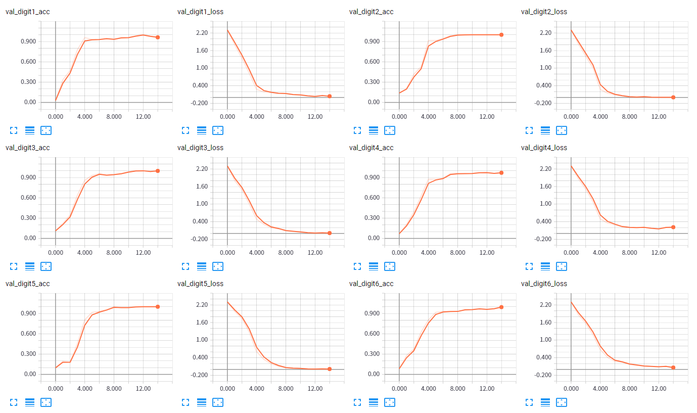

## Issue & Todo
1. Currently unable to solve 5-digits captcha. Maybe implement by CNN + RNN.
2. Improve the grammar and everything in English version README.
3. Re-write captcha_gen.py in better way。
4. Try to use GAN(Generative Adversarial Network) generate the training set.
5. Try to create a new model with capsule network.

## Reference
1. An overview of gradient descent optimization algorithms -  http://ruder.io/optimizing-gradient-descent/index.html
2. SGD，Adagrad，Adadelta，Adam等优化方法总结和比较 - http://ycszen.github.io/2016/08/24/SGD%EF%BC%8CAdagrad%EF%BC%8CAdadelta%EF%BC%8CAdam%E7%AD%89%E4%BC%98%E5%8C%96%E6%96%B9%E6%B3%95%E6%80%BB%E7%BB%93%E5%92%8C%E6%AF%94%E8%BE%83/
3. Going Deeper with Convolutions - http://arxiv.org/abs/1409.4842
