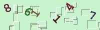
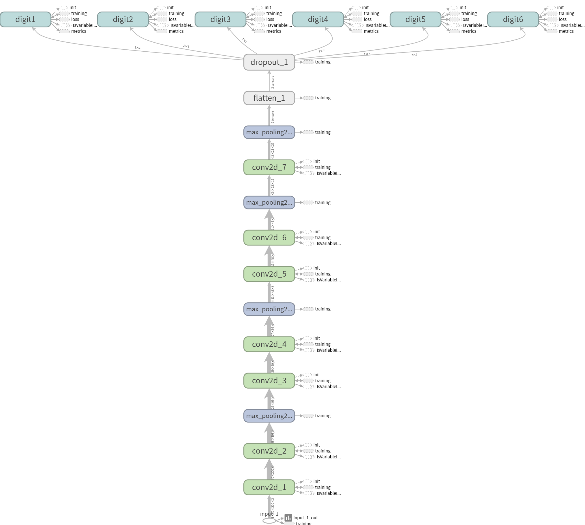

# simple-railway-captcha-solver
[Click here or scroll down for english version](#english-version)


本專案利用簡單的Convolutional Neural Network來實作辨識台鐵訂票網站的驗證碼(如上圖)，訓練集的部分以模仿驗證碼樣式的方式來產生、另外驗證集的部分則自台鐵訂票網站擷取，再以手動方式標記約1000筆。

目前驗證集對於6碼型態的驗證碼的單碼辨識率達到```98.84%```，整體辨識成功率達到```91.13%```。
底下有詳盡的說明。

#### (僅供學術研究用途，切勿違法使用於大量自動訂票等，以免觸犯相關法規。)

|Name|Description|
|----|----|
|captcha_gen.py|模仿驗證碼樣式建立訓練集|
|train_cnn.py  |建立並訓練CNN|
|demo_solver.py|Demo載入模型並辨識驗證碼|

## Dependecies
|Name|Version|
|----|----|
|tensorflow|1.4.0|
|tensorflow-gpu|1.4.0|
|tensorflow-tensorboard|0.4.0rc3|
|Keras|2.1.2|
|h5py|2.7.1|
|Pillow|4.3.0|
|numpy|1.13.3|

## Training set?
要建立一個辨識驗證碼的CNN模型其實並非難事，難的是要如何取得標記好的訓練集呢?



或許你可以寫一支爬蟲程式，擷取個5萬張驗證碼，再自己手動標記答案上去，但這樣有點太費時了，或許我們可以試著模仿產生一些驗證碼看看。
不過當然，我們產生的訓練集必須非常接近真實的驗證碼，否則最後訓練完可能用在真實的驗證碼上效果會非常的差。

## Generate training set

首先我們要先觀察驗證碼，你可以寫一支爬蟲程式去擷取一兩百張驗證碼回來細細比對。我們不難發現台鐵的驗證碼不外乎由兩個主要元素組成：
- ```5 ~ 6碼```的數字，大小似乎不一致，而且都有經過旋轉，另外顏色是浮動的。
- 背景是浮動的顏色，另外還有不少干擾的線條，看起來應該是矩形，由黑線和白線組成，且有部分會蓋到數字上面。

進一步研究會發現:
- 數字的旋轉角度約在```-55 ~ 55度```間，大小約```25 ~ 27pt```。
- 字型的部分，仔細觀察會發現同一個字會有兩種不一樣的樣式，推測是有兩種字型隨機更替，其中一個很明顯是```Courier New-Bold```，另一個比對一下也不難發現即是```Times New Roman-Bold```。
- 背景和字型顏色的部分，可以用一些色彩均值化的手法快速的從數百張的驗證碼中得出每一張的背景及數字的顏色，進而我們就能算出顏色的範圍。這部分可以用opencv的k-means來實作，這邊就不再贅述。

背景的R/G/B範圍約是在```180 ~ 250```間，文字的部分則是```10 ~ 140```間。
- 干擾的線條是矩形，有左、上是黑線條且右、下是白線條和倒過來，共兩種樣式(也可以當作是旋轉180度)，平均大約會出現```30 ~ 32個```隨機分布在圖中，長寬都大約落在```5 ~ 21px```間。
另外，大約有4成的機會白線會蓋在數字上，黑線蓋在文字上的機率則更低。

有了這些觀察，只差一點點就可以產生訓練集了，我們現在來觀察數字都落在圖片上的甚麼位置上:


從這幾張圖中不難看出文字並非規則地分布在圖片上，我們可以猜測文字是旋轉後被隨機左移或右移了，甚至還會有重疊的情況，所以沒辦法用切割的方式一次處理一個文字。

以上就是我們簡單觀察到的驗證碼規則，訓練集產生的部分實作在```captcha_gen.py```中，雖然寫得有點雜亂，不過沒甚麼特別的地方，就是照著上面的規則產生，可以試著以自己的方式實作看看。


最後會輸出5萬張驗證碼圖片和1個標記答案的csv檔。


## Building Convolution Neural Network
來建立一個簡單結構的CNN吧!

輸入是```60*200```的圖片，共有3個channel(R/G/B)，所以是shape會是```(60, 200, 3)```。

中間透過數層由ReLU函數激發的Convolution Layer擷取特徵，並以2x2的Max pooling layer採樣減少計算量，最後經過一個Dropout Layer隨機捨棄一些神經元(避免overfitting)和Flatten Layer來把資料降到1維，輸出到全連接層：6個10神經元的Softmax regression分類器。

```python
tensor_in = Input((60, 200, 3))
out = tensor_in
out = Conv2D(filters=32, kernel_size=(3, 3), padding='same', activation='relu')(out)
out = Conv2D(filters=32, kernel_size=(3, 3), activation='relu')(out)
out = MaxPooling2D(pool_size=(2, 2))(out)
out = Conv2D(filters=64, kernel_size=(3, 3), padding='same', activation='relu')(out)
out = Conv2D(filters=64, kernel_size=(3, 3), activation='relu')(out)
out = MaxPooling2D(pool_size=(2, 2))(out)
out = Conv2D(filters=128, kernel_size=(3, 3), padding='same', activation='relu')(out)
out = Conv2D(filters=128, kernel_size=(3, 3), activation='relu')(out)
out = MaxPooling2D(pool_size=(2, 2))(out)
out = Conv2D(filters=256, kernel_size=(3, 3), activation='relu')(out)
out = MaxPooling2D(pool_size=(2, 2))(out)
out = Flatten()(out)
out = Dropout(0.5)(out)
out = [Dense(10, name='digit1', activation='softmax')(out),\
    Dense(10, name='digit2', activation='softmax')(out),\
    Dense(10, name='digit3', activation='softmax')(out),\
    Dense(10, name='digit4', activation='softmax')(out),\
    Dense(10, name='digit5', activation='softmax')(out),\
    Dense(10, name='digit6', activation='softmax')(out)]
model = Model(inputs=tensor_in, outputs=out)
```

完成後要來compile模型，這邊loss使用```categorical_crossentropy```、optimizer*使用```Adamax```，而metrics理所當然是```accuracy```了。
```python
model.compile(loss='categorical_crossentropy', optimizer='Adamax', metrics=['accuracy'])
```

*關於optimizer的選擇，可以參考這兩篇，寫得不錯：
1. An overview of gradient descent optimization algorithms -  http://ruder.io/optimizing-gradient-descent/index.html
2. SGD，Adagrad，Adadelta，Adam等优化方法总结和比较 - http://ycszen.github.io/2016/08/24/SGD%EF%BC%8CAdagrad%EF%BC%8CAdadelta%EF%BC%8CAdam%E7%AD%89%E4%BC%98%E5%8C%96%E6%96%B9%E6%B3%95%E6%80%BB%E7%BB%93%E5%92%8C%E6%AF%94%E8%BE%83/
**

--

最後來看看model的summary輸出長甚麼樣子：
```python
model.summary()

__________________________________________________________________________________________________
Layer (type)                    Output Shape         Param #     Connected to
======================================================
input_1 (InputLayer)            (None, 60, 200, 3)   0
__________________________________________________________________________________________________
conv2d_1 (Conv2D)               (None, 60, 200, 32)  896         input_1[0][0]
__________________________________________________________________________________________________
conv2d_2 (Conv2D)               (None, 58, 198, 32)  9248        conv2d_1[0][0]
__________________________________________________________________________________________________
max_pooling2d_1 (MaxPooling2D)  (None, 29, 99, 32)   0           conv2d_2[0][0]
__________________________________________________________________________________________________
conv2d_3 (Conv2D)               (None, 29, 99, 64)   18496       max_pooling2d_1[0][0]
__________________________________________________________________________________________________
conv2d_4 (Conv2D)               (None, 27, 97, 64)   36928       conv2d_3[0][0]
__________________________________________________________________________________________________
max_pooling2d_2 (MaxPooling2D)  (None, 13, 48, 64)   0           conv2d_4[0][0]
__________________________________________________________________________________________________
conv2d_5 (Conv2D)               (None, 13, 48, 128)  73856       max_pooling2d_2[0][0]
__________________________________________________________________________________________________
conv2d_6 (Conv2D)               (None, 11, 46, 128)  147584      conv2d_5[0][0]
__________________________________________________________________________________________________
max_pooling2d_3 (MaxPooling2D)  (None, 5, 23, 128)   0           conv2d_6[0][0]
__________________________________________________________________________________________________
conv2d_7 (Conv2D)               (None, 3, 21, 256)   295168      max_pooling2d_3[0][0]
__________________________________________________________________________________________________
max_pooling2d_4 (MaxPooling2D)  (None, 1, 10, 256)   0           conv2d_7[0][0]
__________________________________________________________________________________________________
flatten_1 (Flatten)             (None, 2560)         0           max_pooling2d_4[0][0]
__________________________________________________________________________________________________
dropout_1 (Dropout)             (None, 2560)         0           flatten_1[0][0]
__________________________________________________________________________________________________
digit1 (Dense)                  (None, 10)           25610       dropout_1[0][0]
__________________________________________________________________________________________________
digit2 (Dense)                  (None, 10)           25610       dropout_1[0][0]
__________________________________________________________________________________________________
digit3 (Dense)                  (None, 10)           25610       dropout_1[0][0]
__________________________________________________________________________________________________
digit4 (Dense)                  (None, 10)           25610       dropout_1[0][0]
__________________________________________________________________________________________________
digit5 (Dense)                  (None, 10)           25610       dropout_1[0][0]
__________________________________________________________________________________________________
digit6 (Dense)                  (None, 10)           25610       dropout_1[0][0]
=======================================================
Total params: 735,836
Trainable params: 735,836
Non-trainable params: 0
```

架構以圖片呈現的話:



## Load the training set
在訓練之前我們要先將資料載入到記憶體中，前面產生訓練集的時候，我們是將驗證碼存成一張張編號好的圖片，並用csv檔記錄下了答案。

首先我們先處理X的部分，也就是特徵值，這邊就是指我們的圖片。
而要輸入進CNN的資料必須是numpy array的形式，所以我們用Pillow來讀取圖片並轉為numpy格式：

```python
for index in range(1, 50001, 1)
    image = Image.open("./data/train_set/" + str(index) + ".jpg") # 讀取圖片
    nparr = np.array(image) # 轉成np array
    nparr = nparr / 255.0
```

這時我們下```nparr.shape```，可以看到矩陣的大小是```(60, 200, 3)```，跟前面模型設計的Input是相同的。

而我們計劃使用50000張圖片來訓練，所以最後輸入給CNN的矩陣大小會是```(50000, 60, 200, 3)```，這部分只要利用stack就可以把它們合併，整理成下面:

```python
train_data = np.stack([np.array(Image.open("./data/train_set/" + str(index) + ".jpg"))/255.0 for index in range(1, 50001, 1)])
```

最後train_data的shape就會是```(50000, 60, 200, 3)```。

接下來Y則是訓練集的標記，也就是我們訓練集的答案。

因為我們的模型是多輸出的結構(6組softmax函數分類器)，所以Y要是一個含有6個numpy array的list，大概像是這樣：
```
[[第一張第1個數字,...,最後一張第1個數字], [第一張第2個數字,...,最後一張第2個數字], [...], [...], [...], [...]]
```
而其中每個數字都是以one-hot encoding表示，例如0就是```[1, 0, 0, 0, ....,0]```，2就是```[0, 0, 1, 0, ....,0]```

```python
traincsv = open('./data/train_set/train.csv', 'r', encoding = 'utf8') # 讀取訓練集的標記
read_label = [toonehot(row[1]) for row in csv.reader(traincsv)] # 將每一行的六個數字轉成one-hot encoding
train_label = [[] for _ in range(6)] # 6組輸出的答案要放到train_label

for arr in read_label:
    for index in range(6):
        train_label[index].append(arr[index]) # 原本是[[第1字答案, ..., 第6字答案],......, [第1字答案, ..., 第6字答案]]
                                              # 要轉成[[第1字答案,..., 第1字答案],..., [第6字答案,..., 第6字答案]]才符合Y的輸入
train_label = [arr for arr in np.asarray(train_label)] # 最後要把6個numpy array 放在一個list
```

(這邊忘記說，```toonehot```是定義在```train_cnn.py```中的一個function，功能是將傳入的字串切開分別轉成one-hot encoding再回傳。
舉個例子:傳入```123456```，就會回傳```[[1轉onehot], [2轉onehot], ..., [6轉onehot]]```)


## Validation set
因為擔心模仿產生的訓練集沒辦法有效的使用在真實的驗證碼上，因此驗證集的部分我是用的是自行手動標記的真實驗證碼，這部分資料載入和處理方式跟上面相同，data放在```vali_data```，label放在```vali_label```。

## Callback
在這邊要用到三個callback:

### 1.ModelCheckPoint

```python
checkpoint = ModelCheckpoint(filepath, monitor='val_digit6_acc', verbose=1, save_best_only=True, mode='max')
```

用於儲存最佳辨識率的模型，每次epoch完會檢查一次，如果比先前最佳的acc高，就會儲存model到filepath。

因為在多輸出模型中沒有像是各輸出平均的acc這種東西，觀察前幾epoch後發現```val_digit6_acc```上升最慢，因此用它當作checkpoint的monitor。
(如果要自定義monitor可以自己寫callback，這部分留到未來有空再來實作。)

### 2.Earlystopping

```python
earlystop = EarlyStopping(monitor='val_loss', patience=2, verbose=1, mode='auto')
```

這邊的monitor設為val_loss，patience設為2，也就是在驗證集的loss連續2次不再下降時，就會提早結束訓練。

### 3.TensorBoard

```python
tensorBoard = TensorBoard(log_dir = "./logs", histogram_freq = 1)
```

TensorBoard可以讓我們更方便的以圖形化界面檢視訓練結果，要檢視時可以輸入```tensorboard --logdir=logs```來啟動。

最後把他們三個放到list中即可。
```python
callbacks_list = [tensorBoard, earlystop, checkpoint]
```

## Training the model
至此為止我們已經把所有需要的資料都準備好了，現在只需要一台好電腦就可以開始訓練了，建議使用GPU來訓練，不然要很久，真的很久....。

若在訓練時出現Resource exhausted的錯誤，可以考慮調低一些參數(如batch_size)。

```python
model.fit(train_data, train_label, batch_size=400, epochs=50, verbose=2, validation_data=(vali_data, vali_label), callbacks=callbacks_list)
```

## Result
模型在訓練15 epochs後達到EarlyStopping的條件停止。

驗證集的單碼辨識率達到平均```98.84%```，一次辨識成功率(即一次6碼都辨識正確)達到約```91%```。


## Issue & Todo
1. 目前只能固定辨識6碼的驗證碼，尚無法辨識5碼的。可能可以透過將5碼的標籤加入空白字元，或是後端再接一RNN的方式來實作。
2. 改善英文README的文法之類的。
3. 重寫captcha_gen.py，有點亂。
4. 嘗試用GAN(生成對抗網路)的方式生成訓練集。
5. 嘗試用Capsule network做看看。

## Reference
1. An overview of gradient descent optimization algorithms -  http://ruder.io/optimizing-gradient-descent/index.html
2. SGD，Adagrad，Adadelta，Adam等优化方法总结和比较 - http://ycszen.github.io/2016/08/24/SGD%EF%BC%8CAdagrad%EF%BC%8CAdadelta%EF%BC%8CAdam%E7%AD%89%E4%BC%98%E5%8C%96%E6%96%B9%E6%B3%95%E6%80%BB%E7%BB%93%E5%92%8C%E6%AF%94%E8%BE%83/
3. Going Deeper with Convolutions - http://arxiv.org/abs/1409.4842

--------------------
#### english version
# simple-railway-captcha-solver


This project uses simple convolution neural network to implement solving the captcha(as above, in Taiwan railway booking website).The training set is generated by imitating the style of captcha, and the validation set is crawling from the booking site and labeled manually for about 1000 records.

Currently, the accuracy of a single digit on the validation set is about ```98.84%```, and overall accuracy is ```91.13%``` (Successfully recognize 6-digits at once).

|Name|Description|
|----|----|
|captcha_gen.py|Generating training set by imitating the style of captcha.|
|train_cnn.py  |Building the model and train it.|
|demo_solver.py|Demo:Load the model and solve the captcha.|

## Dependecies
|Name|Version|
|----|----|
|tensorflow|1.4.0|
|tensorflow-gpu|1.4.0|
|tensorflow-tensorboard|0.4.0rc3|
|Keras|2.1.2|
|h5py|2.7.1|
|Pillow|4.3.0|
|numpy|1.13.3|

## Training set?
It is not difficult for building a CNN model to solve a captcha, but where and how do we get a labeled training set?


We can write a program to crawl thousands of captcha image, and labeled it manually, but it's a time-consuming job! Maybe we can try to generate some captcha image by imitating it.
But of course, the image we generate should be really close to the real, otherwise, the accuracy on validation set will really bad.

## Generate training set

Firstly we have to observe the captcha, it's easy to find that the captcha is made up of two primary elements:
- ```5 ~ 6 digits``` number and the text size is not same. Furthermore, they are being rotated, and the color is floating.
- The color of background is floating, and there have some white and black interference lines, and some of them will overlay on the number.

And more...:
- The angle of rotation is between about ```-55 ~ 55 degrees```, and the size is about ```25 ~ 27pt```.
- We can found that one number has not only one style, so we guess that there have two fonts randomly in change. The first one obviously is ```Courier New-Bold```, and the second one is ```Times New Roman-Bold```.(You can use software such as Photoshop to cross-comparison.)
- About the range of background and text color, we can through the color quantization such as k-means to get color of every background and text, and so we can calculate the color range.(I used k-means in opencv to implement.)
- The color range(R/G/B) of the background is between about ```180 ~ 250```, and text is between ```10 ~ 140```.
- Those interference lines form a rectangle, they have two styles: left and up sides are black, right and down sides are white, and vice versa.(you can also treat them as be rotated 180 degrees).
- The number of the rectangle is between about ```30 ~ 32```, randomly distribute on captcha image, and the width and height is between about ```5 ~ 21px```. Besides, there has 40% white line will overlay on the number, and about 20% by the black line.

With these observation, we are about to generate training set! Now, let's observe where the number place on the image:


From these images we can find that the text(number) are not regularly distributed on the image, we can guess that the text is randomly moved left or right after a rotation. There has even some text overlap together, so we can't crop the image and process only one number at a time.

Above is the captcha rule we simply observed. The implement of training set generate is in ```captcha_gen.py```, you can try to implement it in your own way.


The generator finally will output 50,000 captcha image and a csv labeled answer.


## Building Convolution Neural Network

Let's build a simple CNN model!

The input is ```60*200``` image, it has 3 channel(R/G/B), so the shape is ```(60, 200, 3)```.

Firstly, the input through many convolution layers activated by ReLU function to capture feature, and perform downsampling by Max pooling layer, and then get into Dropout layer(randomly drop out some unit to avoid overfitting) and Flatten layer. Finally, they output to the full connect layer: 6 Softmax regression classifiers, each with 10 neurons.

```python
tensor_in = Input((60, 200, 3))
out = tensor_in
out = Conv2D(filters=32, kernel_size=(3, 3), padding='same', activation='relu')(out)
out = Conv2D(filters=32, kernel_size=(3, 3), activation='relu')(out)
out = MaxPooling2D(pool_size=(2, 2))(out)
out = Conv2D(filters=64, kernel_size=(3, 3), padding='same', activation='relu')(out)
out = Conv2D(filters=64, kernel_size=(3, 3), activation='relu')(out)
out = MaxPooling2D(pool_size=(2, 2))(out)
out = Conv2D(filters=128, kernel_size=(3, 3), padding='same', activation='relu')(out)
out = Conv2D(filters=128, kernel_size=(3, 3), activation='relu')(out)
out = MaxPooling2D(pool_size=(2, 2))(out)
out = Conv2D(filters=256, kernel_size=(3, 3), activation='relu')(out)
out = MaxPooling2D(pool_size=(2, 2))(out)
out = Flatten()(out)
out = Dropout(0.5)(out)
out = [Dense(10, name='digit1', activation='softmax')(out),\
    Dense(10, name='digit2', activation='softmax')(out),\
    Dense(10, name='digit3', activation='softmax')(out),\
    Dense(10, name='digit4', activation='softmax')(out),\
    Dense(10, name='digit5', activation='softmax')(out),\
    Dense(10, name='digit6', activation='softmax')(out)]
model = Model(inputs=tensor_in, outputs=out)
```

Now we can do the next step: compile the model: loss use ```categorical_crossentropy```, optimizer* use ```Adamax```, and metrics is ```accuracy```.
```python
model.compile(loss='categorical_crossentropy', optimizer='Adamax', metrics=['accuracy'])
```

*About the choice of an optimizer, you can refer below:
1. An overview of gradient descent optimization algorithms -  http://ruder.io/optimizing-gradient-descent/index.html
2. SGD，Adagrad，Adadelta，Adam等优化方法总结和比较 - http://ycszen.github.io/2016/08/24/SGD%EF%BC%8CAdagrad%EF%BC%8CAdadelta%EF%BC%8CAdam%E7%AD%89%E4%BC%98%E5%8C%96%E6%96%B9%E6%B3%95%E6%80%BB%E7%BB%93%E5%92%8C%E6%AF%94%E8%BE%83/
**

--

Okay! Now we have finished the design of the model, let's see the summary of model:

```python
model.summary()

__________________________________________________________________________________________________
Layer (type)                    Output Shape         Param #     Connected to
======================================================
input_1 (InputLayer)            (None, 60, 200, 3)   0
__________________________________________________________________________________________________
conv2d_1 (Conv2D)               (None, 60, 200, 32)  896         input_1[0][0]
__________________________________________________________________________________________________
conv2d_2 (Conv2D)               (None, 58, 198, 32)  9248        conv2d_1[0][0]
__________________________________________________________________________________________________
max_pooling2d_1 (MaxPooling2D)  (None, 29, 99, 32)   0           conv2d_2[0][0]
__________________________________________________________________________________________________
conv2d_3 (Conv2D)               (None, 29, 99, 64)   18496       max_pooling2d_1[0][0]
__________________________________________________________________________________________________
conv2d_4 (Conv2D)               (None, 27, 97, 64)   36928       conv2d_3[0][0]
__________________________________________________________________________________________________
max_pooling2d_2 (MaxPooling2D)  (None, 13, 48, 64)   0           conv2d_4[0][0]
__________________________________________________________________________________________________
conv2d_5 (Conv2D)               (None, 13, 48, 128)  73856       max_pooling2d_2[0][0]
__________________________________________________________________________________________________
conv2d_6 (Conv2D)               (None, 11, 46, 128)  147584      conv2d_5[0][0]
__________________________________________________________________________________________________
max_pooling2d_3 (MaxPooling2D)  (None, 5, 23, 128)   0           conv2d_6[0][0]
__________________________________________________________________________________________________
conv2d_7 (Conv2D)               (None, 3, 21, 256)   295168      max_pooling2d_3[0][0]
__________________________________________________________________________________________________
max_pooling2d_4 (MaxPooling2D)  (None, 1, 10, 256)   0           conv2d_7[0][0]
__________________________________________________________________________________________________
flatten_1 (Flatten)             (None, 2560)         0           max_pooling2d_4[0][0]
__________________________________________________________________________________________________
dropout_1 (Dropout)             (None, 2560)         0           flatten_1[0][0]
__________________________________________________________________________________________________
digit1 (Dense)                  (None, 10)           25610       dropout_1[0][0]
__________________________________________________________________________________________________
digit2 (Dense)                  (None, 10)           25610       dropout_1[0][0]
__________________________________________________________________________________________________
digit3 (Dense)                  (None, 10)           25610       dropout_1[0][0]
__________________________________________________________________________________________________
digit4 (Dense)                  (None, 10)           25610       dropout_1[0][0]
__________________________________________________________________________________________________
digit5 (Dense)                  (None, 10)           25610       dropout_1[0][0]
__________________________________________________________________________________________________
digit6 (Dense)                  (None, 10)           25610       dropout_1[0][0]
=======================================================
Total params: 735,836
Trainable params: 735,836
Non-trainable params: 0
```


## Load the training set
Before train the model, we have to load the data into memory.

Firstly we have to process X part: feature(our captcha image).
The data we input to CNN should be numpy array type, so we use Pillow to read image and convert it to numpy array.

```python
for index in range(1, 50001, 1)
    image = Image.open("./data/train_set/" + str(index) + ".jpg") #Load our image
    nparr = np.array(image) # Convert to numpy array
    nparr = nparr / 255.0
```

The shape of nparr is ```(60, 200, 3)```, it's same as the input we just designed in the model.
And we plan to use 50,000 captcha image to train the model, so the input shape to CNN will be ```(50000, 60, 200, 3)```. Use numpy.stack to merge them all:

```python
train_data = np.stack([np.array(Image.open("./data/train_set/" + str(index) + ".jpg"))/255.0 for index in range(1, 50001, 1)])
```

Now, the shape of train_data is ```(50000, 60, 200, 3)```。

The next is Y part, label: the answer of the training set.
Because the model is multi-output(6 softmax regression classifier), so the Y should be a list containing 6 numpy array, like this:
```
[[First digit of first image,..., First digit of last image], [Second digit of first image,..., Second digit of last image], [...], [...], [...], [...]]
```
And every digit is present as one-hot encoding, for example 0 is ```[1, 0, 0, 0, ....,0]```, 2 is```[0, 0, 1, 0, ....,0]```

```python
traincsv = open('./data/train_set/train.csv', 'r', encoding = 'utf8')
read_label = [toonehot(row[1]) for row in csv.reader(traincsv)]
train_label = [[] for _ in range(6)]
for arr in read_label:
    for index in range(6):
        train_label[index].append(arr[index])
train_label = [arr for arr in np.asarray(train_label)]
```

## Validation set
The validation set is real captcha image crawl from the railway booking website and labeled manually. Load the data as same as above, and X(feature(image)) put in ```vali_data```, Y(label) in ```vali_label```.

## Callback
We are using 3 callbacks:

### 1.ModelCheckPoint

```python
checkpoint = ModelCheckpoint(filepath, monitor='val_digit6_acc', verbose=1, save_best_only=True, mode='max')
```
For saving best accuracy model, it will check after every epoch, and save the model to filepath if the accuracy is better than before.

### 2.Earlystopping

```python
earlystop = EarlyStopping(monitor='val_loss', patience=2, verbose=1, mode='auto')
```
The monitor set to ```val_loss```, ```patience``` set to 2, that is, if the loss of validation set didn't improve twice in a row, training will be stopped.

### 3.TensorBoard

```python
tensorBoard = TensorBoard(log_dir = "./logs", histogram_freq = 1)
```
TensorBoard is a great visualization tool, we can use it to view our training result.

```python
tensorboard --logdir=logs
```
to start it.


Finally, put them into a list.
```python
callbacks_list = [tensorBoard, earlystop, checkpoint]
```

## Training the model
We have prepared everything we need so far, now we can start training the model!
(If you got Resource exhausted error, try to reduce ```batch_size```.)

```python
model.fit(train_data, train_label, batch_size=400, epochs=50, verbose=2, validation_data=(vali_data, vali_label), callbacks=callbacks_list)
```

## Result
After 15 epochs, the training was stopped by EarlyStopping.
The accuracy for a single digit on the validation set is about ```98.84%```, and overall accuracy is ```91.13%``` (Successfully recognize 6-digits at once).


## Issue & Todo
1. Currently unable to solve 5-digits captcha. Maybe implement by CNN + RNN.
2. Improve the grammar and everything in English version README.
3. Re-write captcha_gen.py in better way。
4. Try to use GAN(Generative Adversarial Network) generate the training set.
5. Try to create a new model with capsule network.

## Reference
1. An overview of gradient descent optimization algorithms -  http://ruder.io/optimizing-gradient-descent/index.html
2. SGD，Adagrad，Adadelta，Adam等优化方法总结和比较 - http://ycszen.github.io/2016/08/24/SGD%EF%BC%8CAdagrad%EF%BC%8CAdadelta%EF%BC%8CAdam%E7%AD%89%E4%BC%98%E5%8C%96%E6%96%B9%E6%B3%95%E6%80%BB%E7%BB%93%E5%92%8C%E6%AF%94%E8%BE%83/
3. Going Deeper with Convolutions - http://arxiv.org/abs/1409.4842
